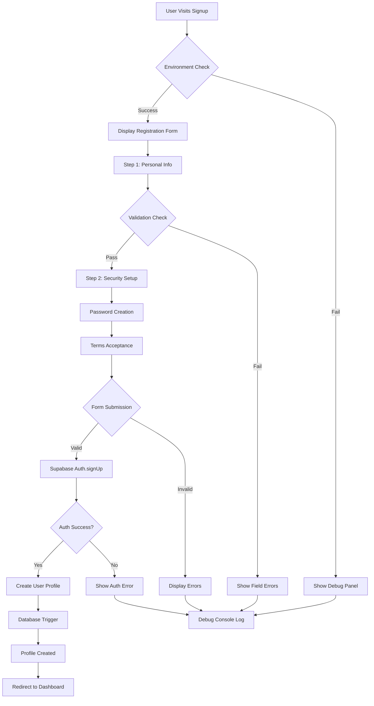
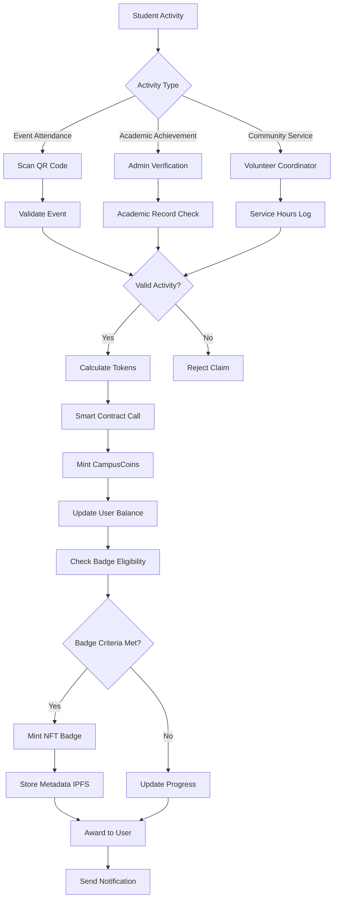
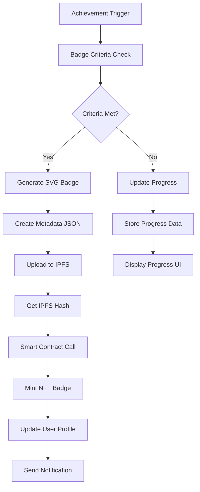
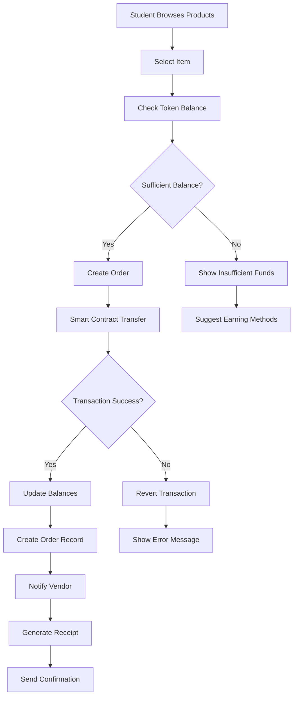

# Campus Connect - Implementation Methodology & Process Documentation

## 🎯 Project Overview
Campus Connect is a tokenized campus economy platform that gamifies student engagement through blockchain-powered rewards, NFT achievements, and a comprehensive marketplace system.

## 📋 Development Methodology

### **1. Design-First Approach**
```
User Research → Design System → Component Library → Page Implementation
```

### **2. Technology Architecture**
```
├── Frontend Layer (Next.js 15 + React 19)
│   ├── Neumorphic UI Components
│   ├── Responsive Design System
│   └── TypeScript Integration
├── Backend Layer (Supabase + Node.js)
│   ├── Authentication System
│   ├── Database Management
│   └── API Endpoints
├── Blockchain Layer (Ethereum)
│   ├── CampusCoin Token (ERC-20)
│   ├── NFT Badge System (ERC-721)
│   └── Smart Contract Integration
└── Storage Layer (IPFS)
    ├── NFT Metadata
    └── Asset Storage
```

## 🔄 Implementation Flow Charts

### **A. User Registration & Authentication Flow**


### **B. Token Economy System Flow**


### **C. NFT Badge System Flow**


### **D. Marketplace Transaction Flow**


## 🏗️ Development Process Phases

### **Phase 1: Foundation Setup (Week 1-2)**
```
✅ Project Structure Setup
├── Next.js 15 Configuration
├── TailwindCSS v3.4.0 Integration
├── TypeScript Configuration
├── Component Library Structure
└── Supabase Integration

✅ Design System Implementation
├── Neumorphic Shadow System
├── Color Palette (NO YELLOW)
├── Typography Scale
├── Spacing System
└── Component Variants
```

### **Phase 2: Core Components (Week 3-4)**
```
✅ UI Component Library
├── Button (6 variants + loading states)
├── Card (flexible layouts)
├── Input (validation + error states)
├── Badge (status indicators)
└── Navigation (responsive + role-based)

✅ Layout Components
├── Header/Navigation
├── Footer
├── Sidebar
└── Grid Systems
```

### **Phase 3: Authentication System (Week 5-6)**
```
✅ User Authentication
├── Supabase Auth Integration
├── Registration Flow (2-step)
├── Login System
├── Password Reset
└── Profile Management

✅ Role-Based Access
├── Student Dashboard
├── Admin Panel
├── Vendor Interface
└── Route Protection
```

### **Phase 4: Core Features (Week 7-10)**
```
✅ Dashboard Implementation
├── Student Dashboard (gamified)
├── Admin Dashboard (management)
├── Real-time Data Display
├── XP Progress System
└── Activity Feeds

✅ Event Management
├── Event Creation
├── Registration System
├── QR Code Integration
└── Attendance Tracking
```

### **Phase 5: Blockchain Integration (Week 11-14)**
```
🔄 Smart Contract Development
├── CampusCoin Token (ERC-20)
├── NFT Badge System (ERC-721)
├── Reward Distribution
└── Marketplace Logic

🔄 Web3 Integration
├── Wallet Connection
├── Transaction Handling
├── Balance Tracking
└── Error Management
```

### **Phase 6: Advanced Features (Week 15-18)**
```
🔄 NFT Badge System
├── Dynamic SVG Generation
├── IPFS Metadata Storage
├── Rarity System
└── Achievement Tracking

🔄 Marketplace
├── Product Catalog
├── Purchase System
├── Vendor Management
└── Order Processing
```

## 🧪 Testing & Quality Assurance

### **Testing Strategy**
```
Unit Testing → Integration Testing → E2E Testing → User Acceptance Testing
```

### **Debug Implementation (Your Preference)**
```javascript
// Comprehensive Button State Debugging
const debugInfo = {
  buttonDisabled: !isValid,
  fieldValues: { firstName, lastName, email },
  validationStatus: {
    firstName: !!firstName?.trim(), // ✓ or ✗
    lastName: !!lastName?.trim(),   // ✓ or ✗
    email: !!email?.trim()          // ✓ or ✗
  },
  trimmedValues: {
    firstName: firstName?.trim(),
    lastName: lastName?.trim(),
    email: email?.trim()
  }
}
```

## 🚀 Deployment Process

### **Development Environment**
```bash
# Local Development
npm run dev         # Start development server
npm run build       # Production build
npm run test        # Run tests
npm run lint        # Code linting
```

### **Production Deployment**
```
Development → Staging → Production
    ↓           ↓          ↓
  Vercel    Testing    Live Site
```

## 📊 Working Prototype Status

### **✅ Completed Features**
```
✅ Neumorphic UI Design System
✅ Responsive Navigation
✅ User Authentication (Supabase)
✅ Role-Based Dashboards
✅ Event Management
✅ Leaderboard System
✅ Profile Management
✅ Debug Panels (Your Preference)
```

### **🔄 In Progress**
```
🔄 Smart Contract Integration
🔄 NFT Badge Minting
🔄 IPFS Storage
🔄 Marketplace Transactions
```

### **📋 Pending**
```
📋 Payment Gateway Integration
📋 Advanced Analytics
📋 Mobile App Development
📋 Third-party Integrations
```

## 🎨 Design Principles Applied

### **User Experience**
- **Mobile-First Design**: Responsive across all devices
- **Accessibility**: WCAG 2.1 compliance
- **Performance**: Optimized loading times
- **User Feedback**: Clear error messages and success states

### **Visual Design**
- **Neumorphic Aesthetics**: Soft, 3D interface elements
- **Consistent Color Scheme**: No yellow elements (per your preference)
- **Typography**: Clear hierarchy and readability
- **Micro-interactions**: Smooth animations and transitions

## 🔧 Development Tools & Workflow

### **Code Quality**
```json
{
  "linting": "ESLint + Prettier",
  "typeChecking": "TypeScript strict mode",
  "testing": "Jest + React Testing Library",
  "debugging": "Comprehensive console logging"
}
```

### **Version Control**
```
Git Workflow: Feature Branch → PR → Review → Merge
```

### **Monitoring & Analytics**
```
Performance: Web Vitals
Errors: Error Boundary + Logging
User Analytics: Custom tracking
Database: Supabase monitoring
```

This implementation methodology ensures a systematic, scalable, and maintainable development process while adhering to your preferences for detailed debugging and clean design aesthetics.