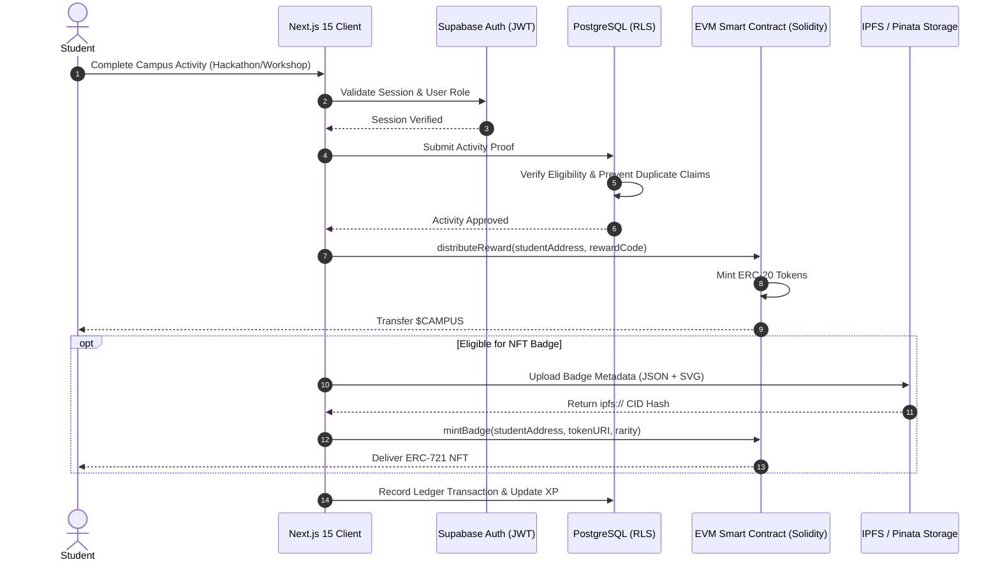
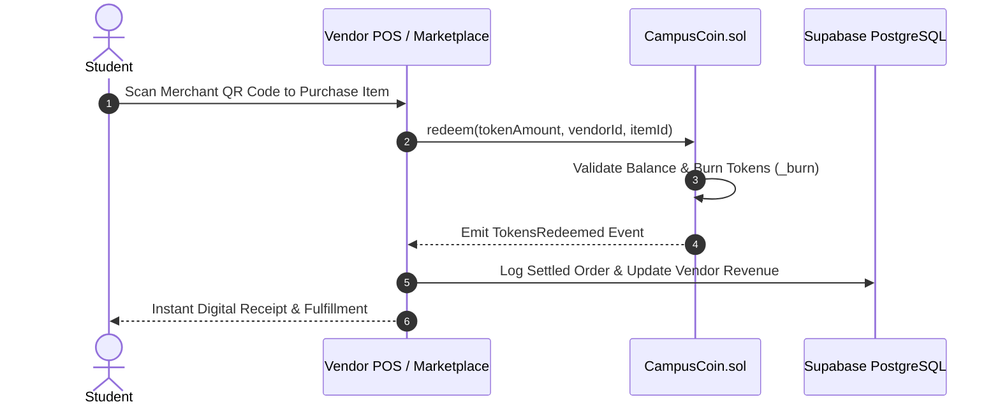

# 🎓 CampusChain — Enterprise Tokenized Campus Economy & Gamified Web3 Engagement Platform

[](https://github.com/DivyeBhatnagar/Campus-Crypto-Tokenized-Campus-Economy-System)
[](https://nextjs.org/)
[](https://react.dev/)
[](https://www.typescriptlang.org/)
[](https://soliditylang.org/)
[](https://supabase.com/)
[](https://wagmi.sh/)
[](https://ipfs.tech/)
[](https://opensource.org/licenses/MIT)

> **Enterprise-Grade Distributed Campus Micro-Economy, Verifiable Credentialing, and Smart Contract Incentive Infrastructure.**  
> Built with **Next.js 15 (App Router)**, **React 19**, **TypeScript**, **Solidity (ERC-20 & ERC-721)**, **Supabase with Row-Level Security (RLS)**, **Wagmi / Viem**, and **IPFS**.

---

## 📌 Executive Summary & Architecture Highlights

**CampusChain** is a production-ready, full-stack Web3 decentralized application (dApp) and campus micro-economy ecosystem. It bridges physical university engagements (academics, hackathons, club activities, campus governance) with on-chain cryptographic incentives, non-fungible verifiable credentials, and zero-trust multi-role commerce.

```
                  ┌──────────────────────────────────────────────────────────┐
                  │                 NEXT.JS 15 APP ROUTER                    │
                  │  (React 19 • TypeScript • Tailwind CSS • Framer Motion)   │
                  └───────────────┬──────────────────────────┬───────────────┘
                                  │                          │
                 REST API / RPC   │                          │  Web3 Provider / RPC
                                  ▼                          ▼
      ┌─────────────────────────────────────┐      ┌─────────────────────────────────────┐
      │     SUPABASE / POSTGRESQL LAYER     │      │       ETHEREUM / EVM LAYER          │
      ├─────────────────────────────────────┤      ├─────────────────────────────────────┤
      │ • Role-Based Access Control (RBAC)  │      │ • CampusCoin ($CAMPUS - ERC-20)     │
      │ • PostgreSQL Row-Level Security     │      │ • CampusBadgeNFT (ERC-721 + IPFS)   │
      │ • Real-time Websocket Subscriptions │      │ • CampusEconomyManager.sol          │
      │ • Audited Ledger & Settlement Engine│      │ • OpenZeppelin Pausable & Guarded   │
      └─────────────────────────────────────┘      └─────────────────────────────────────┘
```

---

## 🚀 Core Technical Competencies & Skills Matrix

| Domain | Core Skills & Technology Keywords |
| :--- | :--- |
| **Frontend Engineering** | `Next.js 15`, `React 19`, `TypeScript`, `Server Components (RSC)`, `Client Components`, `Tailwind CSS`, `Framer Motion`, `Radix UI`, `Recharts`, `Responsive Web Design`, `Dynamic Routing`, `State Management` |
| **Blockchain & Web3** | `Solidity`, `EVM (Ethereum Virtual Machine)`, `Smart Contracts`, `ERC-20 Token Standard`, `ERC-721 NFT Standard`, `Hardhat`, `Wagmi v2`, `Viem`, `Ethers.js`, `IPFS / Pinata Metadata Pinning`, `OpenZeppelin`, `ReentrancyGuard`, `Role-Based Access Control (AccessControl)` |
| **Backend & Cloud Architecture** | `Supabase`, `PostgreSQL`, `Row Level Security (RLS)`, `Database Triggers`, `Stored Procedures`, `RESTful APIs`, `JWT Authentication`, `Event-Driven Architecture`, `Database Schema Normalization` |
| **Security & Systems Design** | `Zero-Trust RBAC`, `Anti-Cheat Event Verification`, `Cryptographic Signatures`, `Pausable Smart Contracts`, `Gas Optimization`, `Audited Ledger Settling` |
| **DevOps & QA** | `Vercel Deployment`, `CI/CD Automation`, `Git Workflow`, `Unit Testing`, `Integration Testing`, `Hardhat Contract Testing` |

---

## ⚡ Key System Features

### 🪙 1. Automated Tokenomics & ERC-20 Economy (`$CAMPUS`)
- **Supply Management**: Maximum capped supply ($1,000,000,000\ \text{CAMPUS}$) with initial reserve distribution.
- **Dynamic Reward Engine**: Admins configure algorithmic reward codes with claim limits and anti-spam cooldown throttles.
- **Deflationary Burn Mechanics**: In-campus vendor redemptions execute atomic burn transactions, reducing circulatory pressure.
- **Emergency Circuit Breaker**: OpenZeppelin `Pausable` governance mechanism for instant contract freeze during anomalies.

### 🎖️ 2. Verifiable Achievement Badges (`ERC-721` + IPFS)
- **Soulbound & Tradable NFT Credentials**: Verifiable academic honors, leadership milestones, and competition victories.
- **Dynamic On-Chain / IPFS Storage**: Multi-tier rarity system (`Common`, `Uncommon`, `Rare`, `Epic`, `Legendary`) backed by immutable IPFS metadata hashes.
- **Algorithmic Badge Minting**: Automatic trigger validation based on XP milestones and verified student event participation.

### 🛡️ 3. Zero-Trust Multi-Role Access Control (RBAC)
- **Student Portal**: Real-time asset portfolio, balance graphs, reward claim gateway, peer transfers, and NFT showcase.
- **Merchant / Vendor Terminal**: POS-ready QR checkout, token redemption settlement, product catalog management, and sales analytics.
- **Administrative Command Center**: Token issuance management, fraud monitoring, automated event verification, and audit logs.

### 📊 4. High-Performance Real-Time Analytics
- **Interactive Telemetry**: Micro-economy health, liquidity, burn vs. mint ratios, and student engagement graphs powered by `Recharts`.
- **Sub-Second Updates**: Real-time Supabase database channels pushing balance changes and settlement confirmations.

---

## 🏛️ System Architecture & Data Flows

### 1. Token Distribution & NFT Minting Pipeline



### 2. Vendor Marketplace Redemption Flow



---

## 📂 Project Repository Structure

```
├── contracts/                       # Smart Contracts (Solidity & Hardhat)
│   ├── CampusBadgeNFT.sol          # ERC-721 Verifiable Credential Contract
│   ├── CampusCoin.sol              # ERC-20 Governance & Incentive Token
│   ├── CampusEconomyManager.sol     # Centralized Settlement & Marketplace Rules
│   ├── hardhat.config.js           # Network & Compiler Configurations
│   └── scripts/                    # Deployment and Verification Scripts
├── src/
│   ├── app/                        # Next.js 15 App Router Architecture
│   │   ├── admin/                  # Administrative Command & Audit Portal
│   │   ├── badges/                 # NFT Credential Explorer & Minting View
│   │   ├── dashboard/              # Student Gamified Analytics & Wallet Hub
│   │   ├── login/                  # Secure JWT Multi-Role Authentication
│   │   ├── marketplace/            # Decentralized Campus Vendor Storefront
│   │   ├── signup/                 # Multi-Step Onboarding with ID Validation
│   │   └── vendor/                 # Merchant Settlement & Analytics Console
│   ├── components/                 # Atomic & Molecule Neumorphic Components
│   │   ├── providers/              # Web3, Wagmi, QueryClient & Theme Providers
│   │   └── ui/                     # Accessible UI Primitives
│   ├── hooks/                      # Custom React Hooks (e.g., useAuth, useContract)
│   ├── lib/                        # Core Utilities (Supabase, Web3, IPFS Engine)
│   │   ├── nft-badges.tsx          # NFT Metadata Builder & SVG Formatter
│   │   ├── supabase.ts             # Typed PostgreSQL Client
│   │   └── web3.ts                 # Wagmi / Viem Blockchain Client Config
│   └── styles/                     # Tailwind CSS Custom Design Tokens
├── supabase_setup.sql              # Production Database Schemas, RLS Policies & Triggers
├── TECHNICAL_FLOW_CHARTS.md        # Detailed Architecture Diagrams
├── IMPLEMENTATION_METHODOLOGY.md   # Systems Design Documentation
└── package.json                    # Project Dependencies & Scripts
```

---

## 🛠️ Tech Stack & Ecosystem

```
Frontend:           Next.js 15.5.2 • React 19.1.1 • TypeScript 5.9 • Tailwind CSS • Framer Motion • Lucide React
State & Data:       @tanstack/react-query • Supabase Realtime • Custom Hooks
Web3 & Blockchain:  Solidity 0.8.20 • Hardhat • Wagmi 2.16 • Viem 2.37 • OpenZeppelin Contracts • IPFS
Database & Auth:    Supabase PostgreSQL 15 • Row Level Security (RLS) • JWT Authentication
UI & Visuals:       Radix UI Primitives • Recharts Data Visualization • Custom Neumorphic System
Testing & Tooling:  ESLint • PostCSS • Git Hooks
```

---

## ⚙️ Quick Start & Installation

### 1. Prerequisites
- **Node.js**: `v18.17.0+` (or `v20.x`)
- **Package Manager**: `npm` / `yarn` / `pnpm`
- **Git**
- **Metamask / Web3 Wallet**

### 2. Clone & Install Dependencies
```bash
# Clone the repository
git clone https://github.com/DivyeBhatnagar/Campus-Crypto-Tokenized-Campus-Economy-System.git
cd Campus-Crypto-Tokenized-Campus-Economy-System

# Install client and smart contract dependencies
npm install
cd contracts && npm install && cd ..
```

### 3. Environment Configuration
Create a `.env.local` file in the root directory:
```env
# Supabase Secrets
NEXT_PUBLIC_SUPABASE_URL=https://your-project.supabase.co
NEXT_PUBLIC_SUPABASE_ANON_KEY=your-anon-key-here

# Web3 Configuration
NEXT_PUBLIC_WALLETCONNECT_PROJECT_ID=your-walletconnect-id
NEXT_PUBLIC_CAMPUS_COIN_ADDRESS=0x0000000000000000000000000000000000000000
NEXT_PUBLIC_CAMPUS_BADGE_ADDRESS=0x0000000000000000000000000000000000000000
```

### 4. Database Setup
1. Head to your [Supabase Dashboard](https://supabase.com).
2. Open the **SQL Editor**.
3. Run the schema migrations from [`supabase_setup.sql`](file:///Users/divyebhatnagar/Desktop/GIT%20ATS/supabase_setup.sql) to provision tables, relational foreign keys, views, and strict RLS policies.

### 5. Smart Contract Compilation & Local Deployment
```bash
cd contracts
npx hardhat compile
npx hardhat run scripts/deploy.js --network localhost
```

### 6. Run the Next.js Development Server
```bash
npm run dev
```
Open [http://localhost:3000](http://localhost:3000) in your browser.

---

## 🔒 Security Posture & Smart Contract Audit Standards

- **OpenZeppelin Standard Implementations**: Implements battle-tested `ERC20Burnable`, `ERC721URIStorage`, and `AccessControl`.
- **Reentrancy Protection**: All state-modifying external contract functions utilize `nonReentrant` guards.
- **Row-Level Security (RLS)**: Zero unauthorized client reads or writes across Supabase tables; strictly enforced user and role tenant isolation.
- **Input Sanitization**: Strong client and server validation with TypeScript static checking.

---

## 📈 Resume / Portfolio Impact Points

If you are showcasing this project on your resume or technical portfolio:
- **Built an end-to-end decentralized campus economy** supporting tokenized micro-transactions and verifiable NFT badges across 3 user roles.
- **Architected gas-optimized Solidity smart contracts** (`ERC-20` & `ERC-721`) with OpenZeppelin access controls, emergency pause, and burn-on-redemption mechanics.
- **Implemented a real-time reactive UI** using **Next.js 15 App Router**, **React 19**, **TypeScript**, and **Tailwind CSS**, achieving sub-second UI updates via Supabase WebSockets.
- **Secured database transactions with PostgreSQL Row Level Security (RLS)** policies, guaranteeing strict zero-trust tenant isolation.
- **Integrated IPFS decentralized storage** for immutable digital credential metadata pinning and verifiable on-chain certificates.

---

## 📜 License
Distributed under the **MIT License**. See `LICENSE` for more information.

---

<p align="center">
  <b>Built with modern Web3 standards for high-performance decentralized systems.</b>
</p>