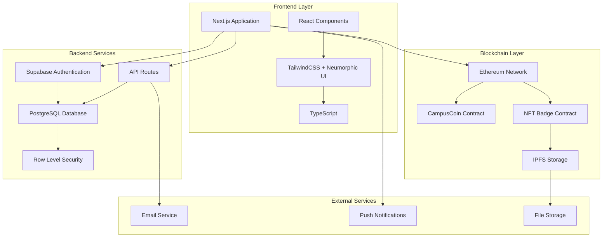
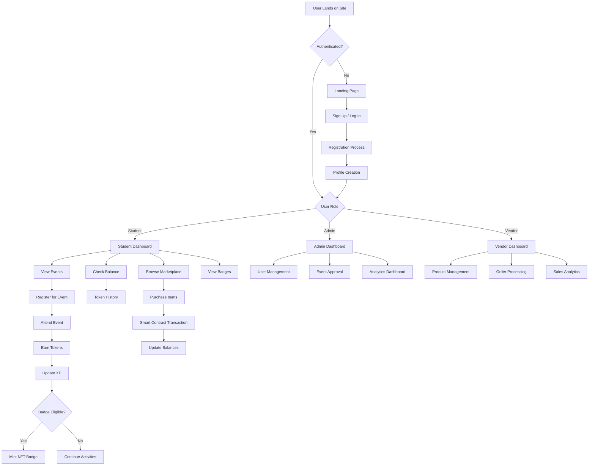
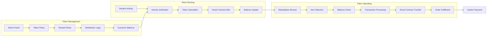
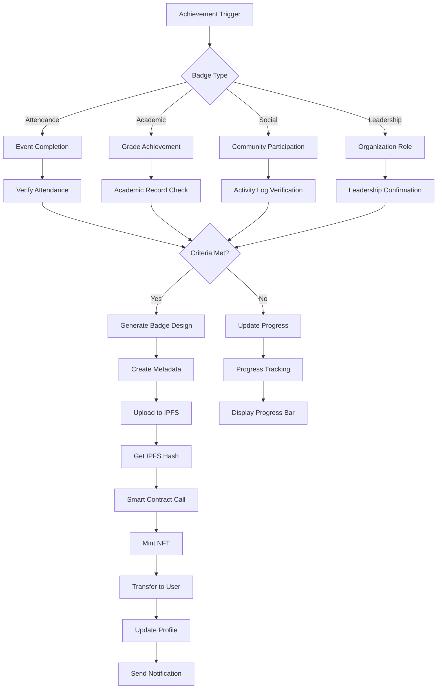
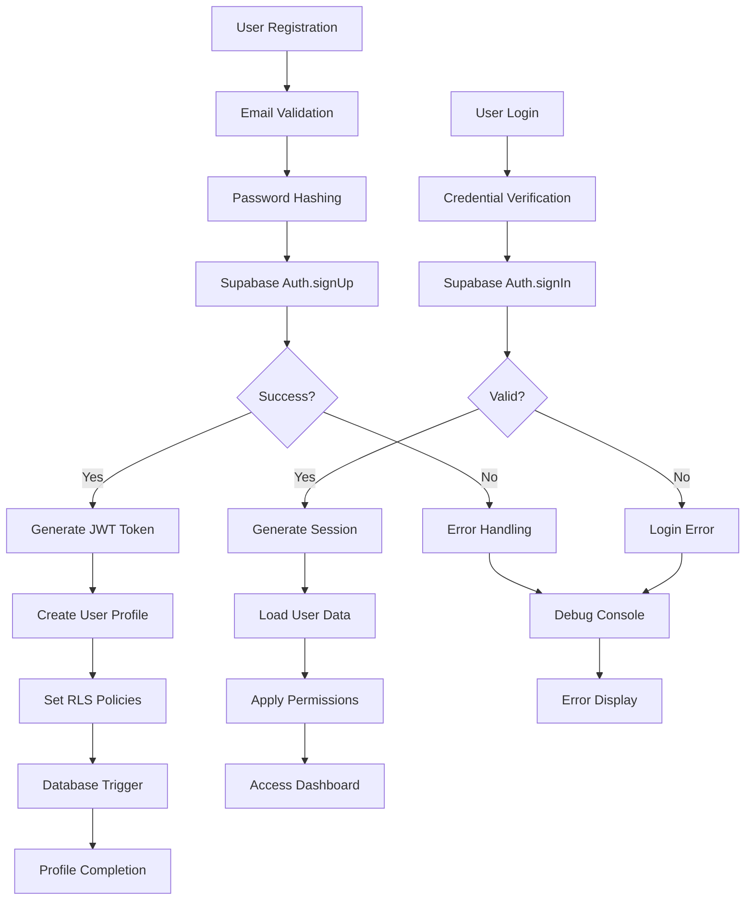
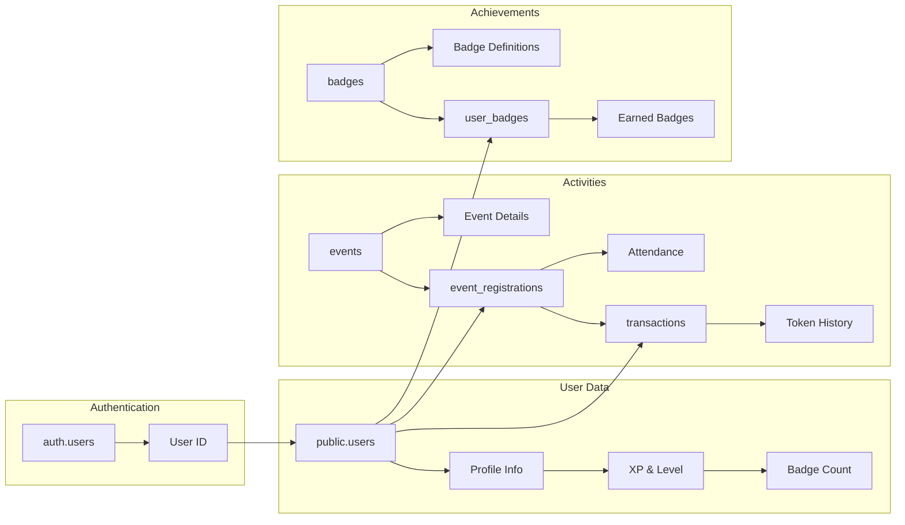
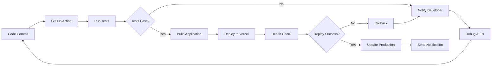
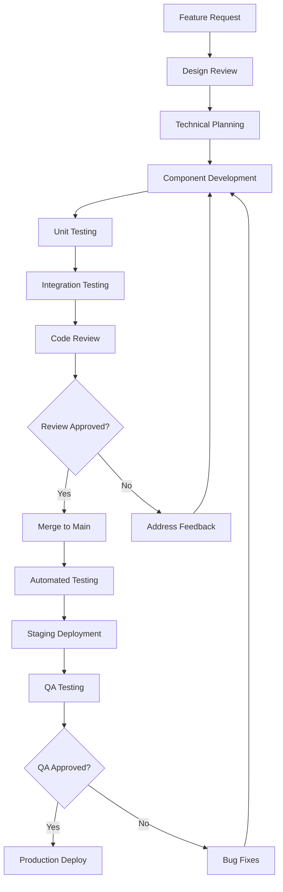

# Campus Connect - Technical Architecture Flow Charts

## 🏗️ System Architecture Overview



## 🔄 User Journey Flow Chart



## 🎯 Token Economy Flow



## 🏆 NFT Badge System Flow



## 🔐 Authentication & Security Flow



## 📱 Component Architecture Flow

```mermaid
graph TB
    subgraph "Page Level"
        A[App Router Pages]
        B[Layout Components]
        C[Page Components]
    end
    
    subgraph "Feature Level"
        D[Dashboard Components]
        E[Auth Components]
        F[Event Components]
        G[Marketplace Components]
    end
    
    subgraph "UI Level"
        H[Button Component]
        I[Card Component]
        J[Input Component]
        K[Badge Component]
        L[Navigation Component]
    end
    
    subgraph "Utility Level"
        M[Hooks (useAuth)]
        N[Utils Functions]
        O[Type Definitions]
        P[API Helpers]
    end
    
    A --> B
    B --> C
    C --> D
    C --> E
    C --> F
    C --> G
    
    D --> H
    D --> I
    E --> J
    F --> K
    G --> L
    
    H --> M
    I --> N
    J --> O
    K --> P
```

## 🗄️ Database Schema Flow



## 🚀 Deployment & CI/CD Flow



## 🔧 Development Workflow



This comprehensive flow chart documentation provides a complete understanding of the Campus Connect implementation methodology, covering all technical aspects from user authentication to blockchain integration.